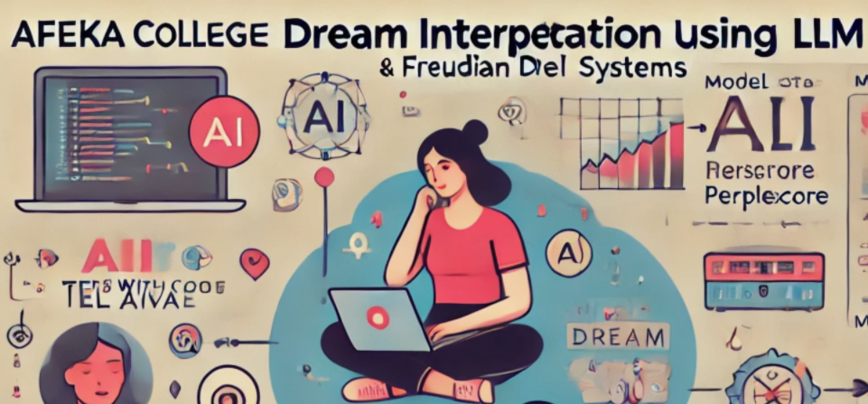

# Dream Interpretation using LLMs



## Introduction
This project explores the use of NLP models for interpreting dreams based on 2 datasets of dreams descriptions. 
It aims to build an AI dream interpretor by leveraging LLMs trained on dream datasets.

**The project has two parts:**

**Part 1** is based on the article: Our Dreams, Our Selves: Automatic Interpretation of Dream Reports.
It uses the data to create 2 LLMs that are dreams interpeators.

**Part 2** is based on.... 
###**ADD**

The resulted 4 models are tested on validtaion dataset of 50 dreams and their interpretations according Freud.
The goal is to analyze and compare the effectiveness of 4 models in generating dream interpretations.

## Dependencies
  ```plaintext
  Python > 3.6
  Pandas 
  NumPy 
  Regular Expressions (re) 
  Datetime 
  Scikit-learn 
  Hugging Face Transformers (pip install transformers)
  Datasets 
  PyTorch >= 1.0
  NLTK 
  OpenCV 
  pytorch-gan-metrics 
  CUDA (Optional) for faster training on NVIDIA GPU
  ```

## Implementation: Part 1:

### **1. Download the Dataset**
The dream dataset used in this project is available on **Dryad**:  
[Dataset Link](https://datadryad.org/stash/dataset/doi:10.5061/dryad.qbzkh18fr)

### **2. Train the Models**
Train GPT-2 and T5 models using the preprocessed dataset:

```bash
python gpt2_train.py
python t5_train.py 
```

This will fine-tune the models on the dreams dataset.


### **3. Evaluate the Models**
Extract test and validation results created compare model performance:

evaluation_metrics.json

Metrics used:
- **BLEU Score** (Measures similarity to reference interpretations)
- **ROUGE Scores** (Measures n-gram overlap)
- **BERTScore** (Semantic similarity)
- **Perplexity** (Measures model confidence)


## **Results**

### **Test Dataset Performance**
| Metric               | GPT-2  | T5    |
|----------------------|--------|-------|
| **BLEU Score**      | 0.0449 | 0.9148 |
| **ROUGE-1**        | 0.1678 | 0.9229 |
| **ROUGE-2**        | 0.0545 | 0.8778 |
| **ROUGE-L**        | 0.1304 | 0.9201 |
| **Perplexity**      | 1.334e11 | 1.0665 |
| **BERTScore (F1)** | 0.7913 | 0.9537 |

**Conclusions: Test Dataset**  
- T5 outperforms GPT-2 significantly in accuracy and fluency.
- Lower Perplexity in T5 means it generates more confident interpretations.

---
## Implementation: Part 2:

# **ADD**


---
### **Validation Dataset Performance: All Models**
| Metric               | GPT-2  | T5    |
|----------------------|--------|-------|
| **BLEU Score**      | 0 | 0 |
| **ROUGE-1**        | 0.0333 | 0.0626 |
| **ROUGE-2**        | 0.0000 | 0.0036 |
| **ROUGE-L**        | 0.0287 | 0.0518 |
| **Perplexity**      | 1.0974 | 1.0639e6 |
| **BERTScore (F1)** | 0.7897 | 0.7984 |

**Final Conclusions:**  
- **Performance drops significantly on validation data**, This is because the validation data is very different from the training and test datasets. While the training data contains only dreams without interpretations (and interpretations were generated manually during training), the validation data is based on interpretations according to Freud. This discrepancy makes it harder for the models to generalize effectively.
- **T5 still performs better than GPT-2**, but the gap is smaller.

  # ADD 2 Models

---

## **Citation**
If you use this project, please cite the original dataset:
```
@dataset{dream_dataset_2025,
  title={Dream Interpretations Dataset},
  author={Author Name},
  year={2025},
  publisher={Dryad},
  doi={10.5061/dryad.qbzkh18fr}
}
```


